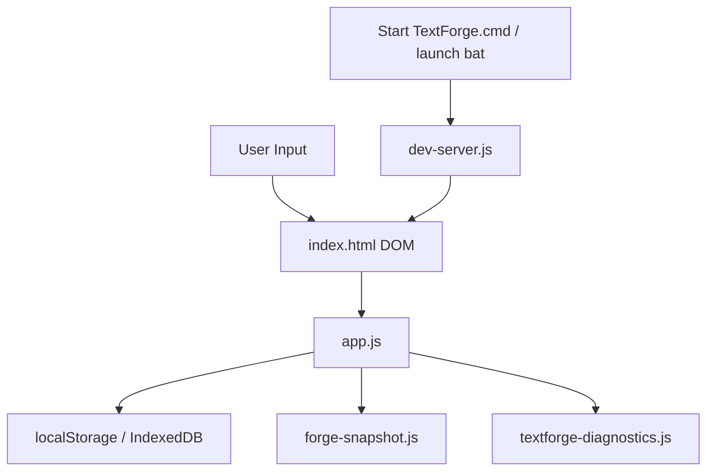
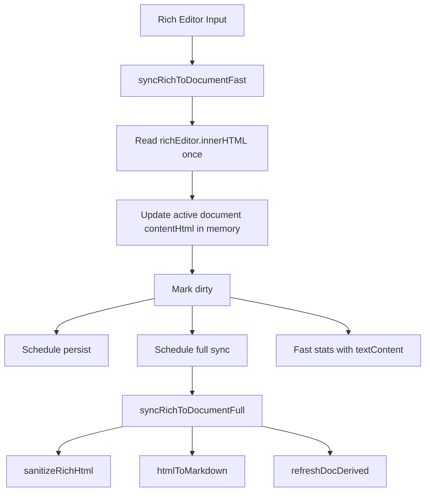
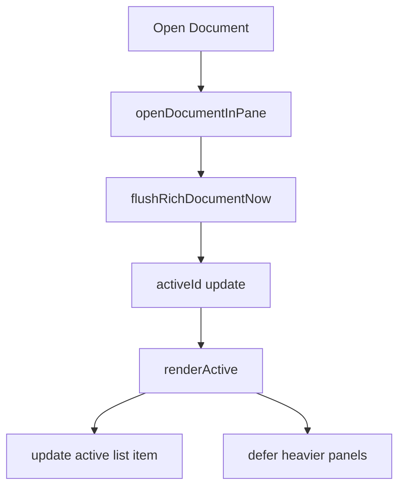

# TextForge Architecture

이 문서는 TextForge의 현재 구조를 설명한다. 기준은 로컬 정적 앱 구조이며, 서버는 개발/실행용 정적 파일 서버로만 동작한다.

## 전체 구조

TextForge는 단일 페이지 웹 앱이다.

- `index.html`: DOM 구조와 dialog, editor, finder, diagnostics 영역
- `styles.css`: 전체 UI, theme, focus mode, split workspace 스타일
- `app.js`: 앱 상태, 문서 모델, 렌더링, 편집, 저장, export, 명령 처리
- `forge-snapshot.js`: 읽기 전용 HTML 아카이브 생성
- `textforge-diagnostics.js`: benchmark와 reliability 진단
- `dev-server.js`: `127.0.0.1:4291` 정적 파일 서버

## 저장 구조

TextForge는 서버에 저장하지 않는다. 기본 저장 대상은 브라우저 프로필이다.

현재 코드에서 확인되는 주요 key:

| Key | 용도 |
| -- | -- |
| `textforge.documents.v1` | 문서 배열 localStorage fallback |
| `textforge.activeDocument.v1` | active document id |
| `textforge.sessionRecovery.v1` | 세션 복구 포인터 |
| `textforge.prompts.v1` | Prompt Vault |
| `textforge.folders.v1` | 폴더 목록 |
| `textforge.theme` | theme preference |
| `textforge.splitWorkspace` | split pane 상태 |
| `textforge.focusMode` | Focus Mode 상태 |
| `textforge.focusCanvasWidth` | Focus Mode 글 박스 폭 |
| `textforge.wordWrap` | 줄바꿈 보기 옵션 |
| `textforge.pointer.v2` | durable storage pointer |

IndexedDB는 `textforge-personal-storage` DB를 사용한다. `state` object store 안에 현재 snapshot과 backup을 저장하는 durable storage 경로가 있다. 저장 실패나 축소 위험을 줄이기 위해 localStorage와 IndexedDB를 함께 사용한다.

## 문서 객체 구조

문서 객체는 대략 다음 필드를 가진다.

| 필드 | 설명 |
| -- | -- |
| `id` | 문서 고유 id |
| `title` | 제목 |
| `content` | Markdown 성격의 source text |
| `contentHtml` | rich editor 기준 HTML |
| `plainText` | 검색/통계/preview용 plain text |
| `previewText` | 문서 목록 preview |
| `searchText` | 검색 대상 문자열 |
| `type` | note, prompt, report, board, log 등 |
| `tags` | 태그 배열 |
| `favorite` | 즐겨찾기 여부 |
| `folderId` | 폴더 id |
| `history` | 문서 스냅샷 배열 |
| `createdAt` | 생성일 |
| `updatedAt` | 수정일 |
| `wordCount` | 단어 수 |
| `charCount` | 글자 수 |

## 입력 루프

긴 문서 입력 성능을 위해 rich editor 입력은 fast sync와 full sync로 분리되어 있다.

Fast path에서 하지 않는 것:

- 전체 sanitize
- Markdown 변환
- plainText/searchText 전체 재계산
- preview 강제 렌더
- 무거운 stats 계산

Full sync는 저장, export, mode 전환, 문서 전환, idle/debounce 시점에 실행된다.

## 렌더링 구조

주요 렌더 함수:

| 함수 | 역할 |
| -- | -- |
| `renderActive()` | active document를 editor/source/preview 상태에 반영 |
| `renderDocList()` | 왼쪽 문서 shortcut 목록 렌더 |
| `renderFinder()` | Finder 스타일 문서함 렌더 |
| `renderPreview()` | preview, toc, info/system panel, split refresh 예약 |
| `renderSystemPanel()` | 링크, 백링크, storage, line guard 정보 |
| `renderDocInfoPanel()` | 문서 메타 정보 |
| `renderSplitWorkspace()` | split workspace와 reference pane 렌더 |

문서 전환은 fast path가 적용되어 있고, 전체 doc list 재렌더를 줄이기 위한 selected item 갱신 경로도 있다.

## Forge Snapshot 구조

`forge-snapshot.js`는 app.js에서 context를 받아 문서 배열을 read-only archive로 굽는다. 결과 HTML 안에는 `#textforge-snapshot-data` JSON script가 포함된다. 이 파일은 열람과 복사용이며, 현재 편집기 import 기능은 별도 구현되어 있지 않다.

## Diagnostics 구조

`textforge-diagnostics.js`는 `window.TextForgeDiagnostics` API를 노출한다. app.js는 문서 clone, export, snapshot, render 관련 context를 제공한다. 주요 기능은 Quick Benchmark, Full Benchmark, Reliability, Forge Snapshot Benchmark, MTTR, Real Library Benchmark 등이다.

## 안전 구조

안전 정책은 다음으로 구성된다.

- History Snapshot: 수동/자동 문서 스냅샷
- Safety Snapshot: bulk 작업 전 기존 history에 보존
- Bulk undo/redo: 전체 문서 서식 적용/제거 같은 bulk operation 복구
- Forge Snapshot: 읽기 전용 HTML 아카이브
- AI 출력 정리 원본 보호: 원본 덮어쓰기 대신 새 문서 생성
- 자동 줄바꿈 display-only: contentHtml을 바꾸지 않고 CSS class와 preference만 변경

## 성능 최적화 포인트

- 문서 전환 fast path
- typing fast sync / full sync 분리
- preview lazy update
- hidden preview 렌더 생략
- line guard banner 제거로 layout shift 방지
- Focus Mode width resize는 CSS variable만 변경

## 건드리면 위험한 영역

- 저장 key와 문서 객체 구조
- `contentHtml` / `content` 변환 규칙
- Smart Copy / Export 변환 로직
- Forge Snapshot 생성 로직
- durable storage shrink guard
- fast sync와 full sync 호출 순서
- dark color adaptation
- safety snapshot / bulk undo 정책
