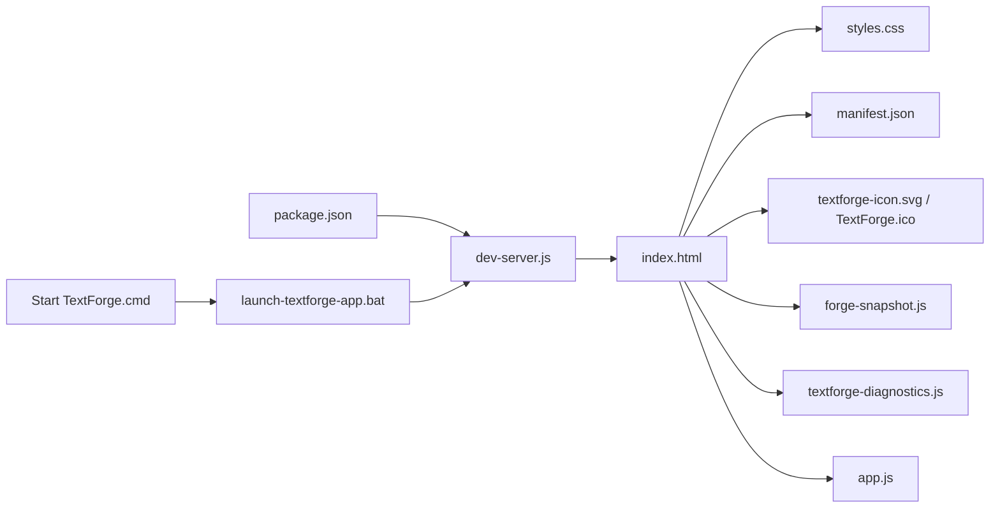
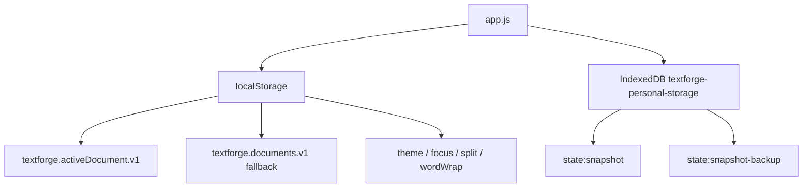

# TextForge File Dependency Map

이 문서는 실제 프로젝트 파일 기준으로 작성한 의존성 지도다.

## 루트 주요 파일

| 파일 | 역할 | 의존하는 파일 | 의존받는 곳 | 주의사항 |
| -- | -- | -- | -- | -- |
| `index.html` | 앱 DOM, dialog, editor, finder, snapshot, diagnostics UI | `styles.css`, `forge-snapshot.js`, `textforge-diagnostics.js`, `app.js`, `manifest.json`, icons | 브라우저, dev server | DOM id 변경 시 `app.js`의 `els` 매핑이 깨진다. |
| `styles.css` | 전체 UI, theme, focus mode, split workspace, editor 스타일 | CSS variables, DOM class/id | `index.html` | layout shift를 만들 수 있는 block UI 변경 주의. |
| `app.js` | 핵심 앱 로직, 상태, 저장, 편집, 렌더링, export, command palette | DOM id, localStorage, IndexedDB, `ForgeSnapshot`, `TextForgeDiagnostics` | `index.html` | 저장 포맷과 editor loop 변경은 고위험. |
| `forge-snapshot.js` | Forge Snapshot 생성 및 snapshot viewer HTML 생성 | app.js가 넘기는 context | `app.js`, snapshot dialog | read-only archive 목적. import 기능은 별도. |
| `textforge-diagnostics.js` | benchmark, reliability, MTTR, release readiness | app.js context, browser APIs | `app.js`, diagnostics dialog | 실제 문서 수정이 없도록 read-only clone 원칙 필요. |
| `dev-server.js` | 로컬 정적 서버 | Node `http/fs/path` | `npm start`, launch scripts | `127.0.0.1:4291`에 바인딩. |
| `package.json` | npm scripts | `dev-server.js`, check 대상 JS | 개발자 | `npm.cmd run check`가 Windows PowerShell 정책 회피에 유용. |
| `manifest.json` | PWA/app mode manifest | icon files | browser | app mode 표시와 아이콘에 영향. |
| `launch-textforge-app.bat` | 서버 확인 후 Edge/Chrome app mode 실행 | `dev-server.js` | `Start TextForge.cmd` | 브라우저 경로와 포트 확인 필요. |
| `Start TextForge.cmd` | 사용자가 실행하는 wrapper | `launch-textforge-app.bat` | 사용자 | app mode 실행 진입점. |
| `Create TextForge Shortcut.cmd` | shortcut 생성 wrapper | `create-textforge-shortcut.ps1` | 사용자 | Windows shortcut 생성용. |
| `create-textforge-shortcut.ps1` | desktop shortcut 생성 | launcher, icon | cmd wrapper | PowerShell 실행 정책 영향 가능. |
| `run-document-switch-benchmark.cjs` | headless Edge 문서 전환 benchmark | Edge, CDP, app URL | 개발자 | 임시 프로필 측정. 실제 사용자 프로필과 다를 수 있음. |
| `README.md` | 프로젝트 진입 문서 | docs 링크 | GitHub / 개발자 | 세부 설명은 docs로 연결. |

## HTML 로드 순서

`index.html`은 다음 순서로 로드한다.

1. theme bootstrap inline script
2. `manifest.json`
3. `textforge-icon.svg`
4. `styles.css`
5. `forge-snapshot.js`
6. `textforge-diagnostics.js`
7. `app.js`

`app.js`는 마지막에 로드되므로, Snapshot과 Diagnostics 전역 API가 먼저 준비된다.

## app.js와 DOM id 관계

`app.js` 시작부의 `els` 객체는 `index.html`의 id를 직접 참조한다. 대표 영역:

- 문서 목록: `docList`, `newDocBtn`, `searchInput`
- editor: `titleInput`, `editor`, `richEditor`, `editorGrid`, `editorPaneLabel`, `statsText`
- safety / view: `guardBanner`, `wrapToggleBtn`, `breakLineBtn`
- export/copy: `copyPlainBtn`, `exportTxtBtn`, `exportCardBtn`
- finder: `finderOpenBtn`, `finderGrid`, `finderTagList`, `finderFolderList`
- inspector: `inspector`, `historyList`, `tocList`, `systemList`, `docInfoList`
- snapshot: `forgeSnapshotDialog` 내부 요소는 `forge-snapshot.js`에서 직접 조회
- diagnostics: `diagnosticsDialog` 내부 요소는 `textforge-diagnostics.js`에서 직접 조회
- focus resize: `focusResizeLeft`, `focusResizeRight`

DOM id를 바꾸면 JS가 바로 깨질 수 있으므로 HTML 변경 전 `rg`로 사용처를 확인해야 한다.

## app.js와 forge-snapshot.js 관계

`app.js`는 `openForgeSnapshotPanel()`에서 `window.ForgeSnapshot.openForgeSnapshotDialog()`를 호출한다. 이때 다음 context를 전달한다.

- documents clone
- folders
- selected ids
- current folder id
- Markdown/HTML/plain 변환 helper
- file download helper

`forge-snapshot.js`는 그 context를 기준으로 snapshot data를 만들고, read-only viewer HTML을 생성한다.

## app.js와 textforge-diagnostics.js 관계

`app.js`는 diagnostics context를 구성하고 `window.TextForgeDiagnostics.configure()`에 넘긴다. Diagnostics는 이 context로 benchmark를 실행한다.

주의:

- real library benchmark는 실제 문서함 clone 기준이어야 한다.
- stress/MTTR는 사용자 문서를 직접 변형하면 안 된다.
- 결과 JSON은 repo에 남을 수 있으므로 실제 민감 문서 내용이 포함되지 않게 주의한다.

## 저장 관련 의존성

## release와 docs 폴더

- `releases/`는 안정 버전 복사본과 zip 보관용이다.
- `docs/`는 현재 프로젝트 인수인계 문서 폴더다.
- release copy와 실제 사용자 문서 백업은 다르다.

## 임시/진단 폴더

루트에는 `.chrome-*`, `.tmp-edge-*` 진단 프로필 폴더가 존재한다. 이들은 headless 또는 임시 브라우저 프로필 기반 테스트 흔적이다. 릴리즈 소스와 사용자 문서 백업으로 취급하면 안 된다.
